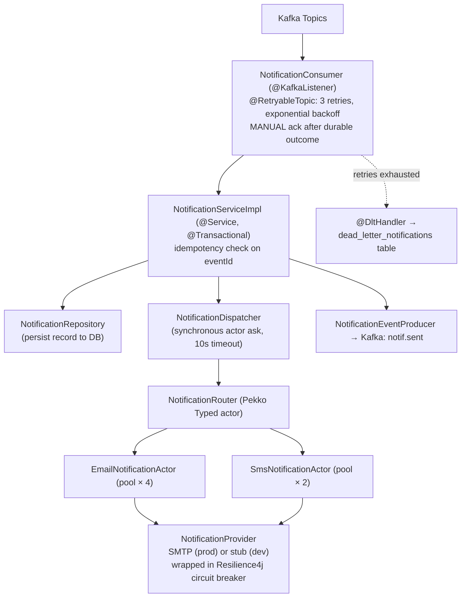

# Notification Service

Sends multi-channel notifications (email, SMS) in response to Kafka events from the order lifecycle. Built with **Java 21 + Spring Boot 3 + Pekko Typed**. Kafka messages are consumed by Spring `@KafkaListener` and dispatched to Pekko actors via a **synchronous ask** — the Kafka offset is committed only after the delivery outcome is durable.

---

## Responsibilities

- Consume `order.created` → send order confirmation email/SMS
- Consume `order.cancelled` → send cancellation email (reason-aware messaging)
- Consume `order.cancel.requested` → send out-of-stock alert
- Consume `order.returned` → send return approval + refund initiated email
- Idempotent consumption — duplicate event deliveries are no-ops (unique constraint on `eventId` + template + channel)
- Persist all notification records to DB (audit log)
- Persist exhausted messages to `dead_letter_notifications` for replay
- Scheduled retry of failed deliveries (`NotificationRetryJob`)
- Publish `notif.sent` after each successful dispatch
- Circuit breakers around external delivery providers (Resilience4j)
- REST API for notification history lookup

---

## Architecture



---

## Technology

| Component | Technology |
|-----------|-----------|
| Language | Java 21 |
| Web framework | Spring Boot 3.3.1 |
| Kafka consumer | Spring Kafka with `@RetryableTopic`, MANUAL ack |
| Actor model | Pekko Typed 1.1.3 (Java API) |
| Database | Spring Data JPA + PostgreSQL |
| DB migrations | Flyway 10.15.0 (auto-run by Spring Boot) |
| JSON | Jackson with JSR-310 (Instant support) |
| Email delivery | Spring Mail (`spring-boot-starter-mail`) — stubbed by default |
| Resilience | Resilience4j circuit breakers around delivery providers |
| Metrics | Micrometer + Prometheus registry |

---

## Running Locally

### With Docker Compose (recommended)

```bash
# From project root
docker-compose up notification-service postgres kafka kafka-init
```

### Standalone

```bash
# From project root — requires Postgres and Kafka running
mvn -pl notification-service spring-boot:run
```

### Environment Variables

| Variable | Default | Description |
|----------|---------|-------------|
| `SERVER_PORT` | `8083` | HTTP server port |
| `SPRING_DATASOURCE_URL` | `jdbc:postgresql://localhost:5432/ops_notifications` | PostgreSQL URL |
| `SPRING_DATASOURCE_USERNAME` | `ops` | DB username |
| `SPRING_DATASOURCE_PASSWORD` | `changeme` | DB password |
| `SPRING_KAFKA_BOOTSTRAP_SERVERS` | `localhost:9092` | Kafka bootstrap servers |
| `NOTIFICATION_EMAIL_ENABLED` | `false` | Send real email via SMTP; when `false` the stub provider logs instead |
| `NOTIFICATION_SMS_ENABLED` | `false` | Send real SMS; when `false` the stub provider logs instead |
| `NOTIFICATION_FROM_EMAIL` | `no-reply@ops.local` | From address for outgoing email |
| `SMTP_HOST` / `SMTP_PORT` | `localhost` / `587` | SMTP server (only used when email is enabled) |
| `SMTP_USERNAME` / `SMTP_PASSWORD` | *(empty)* | SMTP credentials |
| `NOTIFICATION_ACTOR_EMAIL_POOL_SIZE` | `4` | Email actor pool size |
| `NOTIFICATION_ACTOR_SMS_POOL_SIZE` | `2` | SMS actor pool size |
| `NOTIFICATION_RETRY_ENABLED` | `true` | Enable the scheduled retry job for FAILED notifications |
| `NOTIFICATION_RETRY_INTERVAL_MS` | `300000` | Retry job interval (5 min) |
| `NOTIFICATION_RETRY_MAX_ATTEMPTS` | `5` | Max attempts before a record is left terminally FAILED |

---

## API Endpoints

Base URL: `http://localhost:8083` (direct) or `http://localhost:8080/api/notifications` (via gateway)

| Method | Path | Description |
|--------|------|-------------|
| `GET` | `/notifications?orderId={id}` | Get all notifications for an order |
| `GET` | `/notifications/{id}` | Get a single notification by ID |
| `GET` | `/actuator/health` | Liveness + readiness probe |

### List Notifications — Example

```bash
curl "http://localhost:8083/notifications?orderId=ord-abc123" \
  -H "X-Trace-Id: trace-xyz"

# Response:
# [
#   {
#     "id": "notif-uuid",
#     "orderId": "ord-abc123",
#     "channel": "EMAIL",
#     "template": "ORDER_CONFIRMED",
#     "status": "DELIVERED",
#     "sentAt": "2026-06-29T10:30:03Z"
#   }
# ]
```

---

## Kafka Topics

| Direction | Topic | When |
|-----------|-------|------|
| **Consumes** | `order.created` | Order placed |
| **Consumes** | `order.cancelled` | Order cancelled |
| **Consumes** | `order.cancel.requested` | Out-of-stock cancellation |
| **Consumes** | `order.returned` | Return approved |
| **Produces** | `notif.sent` | After notification dispatched |

### Dead Letter Handling

If a message fails after 3 retries, it is sent to the dead-letter topic (e.g. `order.created.DLT`) **and persisted to the `dead_letter_notifications` table** by the `@DltHandler` — including original topic/partition/offset, message key, payload, exception details, and trace ID.

**Monitor both** the DLT topics in Kafka UI and the `notification.deadletter.count` Prometheus gauge — any record here indicates a processing failure that needs investigation or replay.

---

## Reliability Semantics

| Concern | Mechanism |
|---------|-----------|
| Duplicate Kafka deliveries | Idempotency key: unique partial index on `(event_id, template, channel)`; duplicates are skipped before insert, and a `DataIntegrityViolationException` catches races |
| Offset commits | `MANUAL` ack — the offset is committed only after the service reports a durable outcome (delivered or duplicate-skipped) |
| Actor dispatch | Synchronous ask via `NotificationDispatcher` (10s timeout) — no fire-and-forget; failures throw and roll back the transaction so `@RetryableTopic` redelivers |
| Exhausted retries | `@DltHandler` persists the message to `dead_letter_notifications` |
| Failed deliveries | `NotificationRetryJob` retries FAILED records every 5 min, up to 5 attempts |
| Provider outages | Resilience4j circuit breakers (`emailProvider`, `smsProvider`): 50% failure rate over 10 calls opens the breaker for 30s |
| Recipient resolution | Events carry optional `customerEmail`/`customerPhone`; `RecipientResolver` falls back to a placeholder address in dev |

---

## Observability

### Health probes

Spring Boot probe groups are enabled (`management.endpoint.health.probes.enabled=true`):

| Probe | Path | Includes |
|-------|------|----------|
| Liveness | `/actuator/health/liveness` | `livenessState`, `actorSystem` |
| Readiness | `/actuator/health/readiness` | `readinessState`, `db`, `kafka`, `actorSystem` |

Custom indicators: `KafkaHealthIndicator` (broker reachability) and `ActorSystemHealthIndicator` (Pekko system state).

### Metrics (Prometheus)

Scrape `/actuator/prometheus`. Key metrics:

| Metric | Type | Description |
|--------|------|-------------|
| `notification.records.pending` | gauge | PENDING records in DB |
| `notification.records.failed` | gauge | FAILED records in DB |
| `notification.deadletter.count` | gauge | Rows in `dead_letter_notifications` |
| delivery success/failure counters | counter | recorded in `NotificationRouter` per channel |

---

## Notification Templates

| Template | Trigger | Channel |
|----------|---------|---------|
| `ORDER_CONFIRMED` | `order.created` consumed | Email + SMS |
| `ORDER_CANCELLED` | `order.cancelled` consumed | Email |
| `ORDER_CANCELLED_OUT_OF_STOCK` | `order.cancel.requested` consumed | Email |
| `RETURN_APPROVED` | `order.returned` consumed | Email + SMS |
| `REFUND_INITIATED` | `order.returned` consumed | Email |

---

## Database

Database: `ops_notifications`

| Table | Description |
|-------|-------------|
| `notifications` | Audit log of every notification sent (channel, template, status, attempts, `event_id` idempotency key) |
| `dead_letter_notifications` | Messages that exhausted Kafka retries (payload + exception + trace ID) for replay |

Migrations: `src/main/resources/db/migration/`  
Flyway runs automatically on application startup (before JPA initialises).

- `V1` — base `notifications` table
- `V2` — `event_id` column + unique partial index on `(event_id, template, channel)`, and the `dead_letter_notifications` table

---

## Adding a New Notification Channel

1. Add a new `record` to `NotificationCommand.java` (sealed interface), carrying the notification ID and a `replyTo: ActorRef<DeliveryResult>`
2. Add a new actor in `actor/` implementing the channel; it must reply `DeliveryResult` (success/failure) to `replyTo`
3. Add a `Behaviors.receive` case in `NotificationRouter.java`
4. Call the new command from `NotificationServiceImpl` via `NotificationDispatcher.dispatch(...)`

To add a new delivery vendor, implement `NotificationProvider` and wire it in `ProviderConfig` — channel actors stay unchanged.

---

## Testing

```bash
mvn -pl notification-service test
```

- **Unit tests** — consumer (idempotency/ack/DLT paths), service layer, `RecipientResolver`
- **Actor tests** — `EmailNotificationActorTest`, `SmsNotificationActorTest`, `NotificationRouterTest` (Pekko test kit)
- **Provider tests** — `SmtpNotificationProviderTest`
- **Contract tests** — `EventContractTest` verifies the service can consume the shared `KafkaEvents.scala` payloads (fixtures in `src/test/resources/`)

---

## Build

```bash
# From project root
mvn -pl notification-service package -DskipTests
mvn -pl notification-service test
docker build -t ops/notification-service ./notification-service
```
